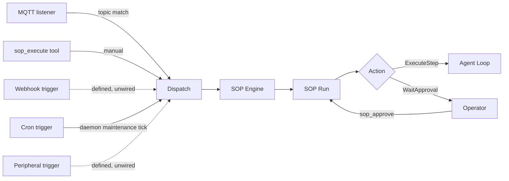

# How SOPs run

## Runtime contract

- SOP definitions are loaded from `<workspace>/sops/<sop_name>/SOP.toml` plus optional `SOP.md`.
- CLI `zeroclaw sop` manages definitions with `list`, `validate`, `show`, `graph`, and `delete`, and manages approval gates with `pending`, `approve`, and `deny`.
- SOP runs are started by a live event fan-in (MQTT, filesystem, or AMQP), by the daemon's periodic SOP maintenance tick for `cron` triggers, or by the in-agent tool `sop_execute`. The remaining trigger types (webhook, peripheral, calendar) are defined and matched but not yet wired to a live event source (see [SOP Fan-In](./fan-in/overview.md)).
- Run progression uses tools: `sop_status`, `sop_approve`, `sop_advance`.
- Agent steps execute under the SOP's bound agent when the manifest sets `agent = "<alias>"` (a step-level `- agent:` bullet overrides it per step). Unbound steps driven inside an agent turn by `sop_execute`, `sop_approve`, or `sop_advance` inherit the calling agent; a step bound to another agent is reassembled under that agent or refused when reassembly is unavailable. Where an unbound agent step reaches the headless run driver (an approval surface resuming a gate or the gateway manual-run endpoint starting a run), the current fallback is the `[agents]` key that sorts first by string byte order, including disabled entries; with no configured key, the fallback is an empty alias. Cron-, fan-in-, RPC `sops/run`-, and approval-timeout auto-approval-dispatched agent steps do not currently have an agent loop and remain parked. Bind the agent explicitly for any SOP whose steps run shell or file tools.
- Run state is process-local by default. With `sop.persist_runs = true`, successful initialization of the default SQLite backend stores it under `<data_dir>/sop/runs.db` and restores active runs after restart. Initialization failure logs a warning and falls back to process-local memory.
- SOP audit records are persisted in the configured Memory backend under category `sop`.

Run state and audit history are separate surfaces. See [Background work lifecycle](../architecture/background-work-lifecycle.md) for lifecycle ownership, cancellation, and restart semantics.

## Event flow



## Getting started

1. Set the SOP directory through the gateway, zerocode, or `zeroclaw config set` (required for runtime SOP loading):

2. Create a SOP directory, for example:

   ```text
   ~/.zeroclaw/workspace/sops/deploy-prod/SOP.toml
   ~/.zeroclaw/workspace/sops/deploy-prod/SOP.md
   ```

3. Validate and inspect definitions:

   <div class="os-tabs-src">

   #### sh

   ```sh
   zeroclaw sop list
   zeroclaw sop validate
   zeroclaw sop show deploy-prod
   ```

   </div>

4. Trigger runs via configured event sources, or manually from an agent turn with `sop_execute`.

For trigger routing and auth details, see [SOP Fan-In](./fan-in/overview.md).
